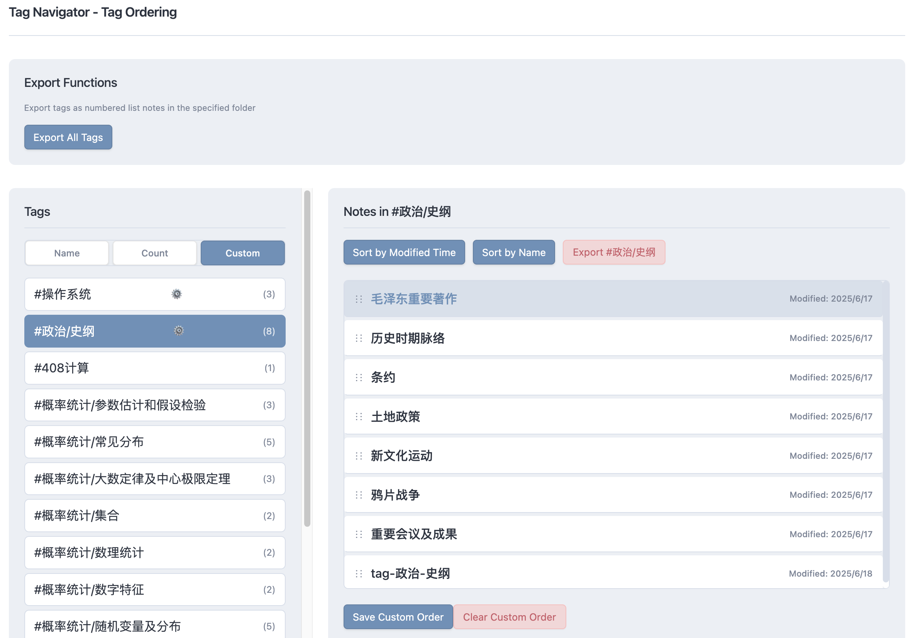
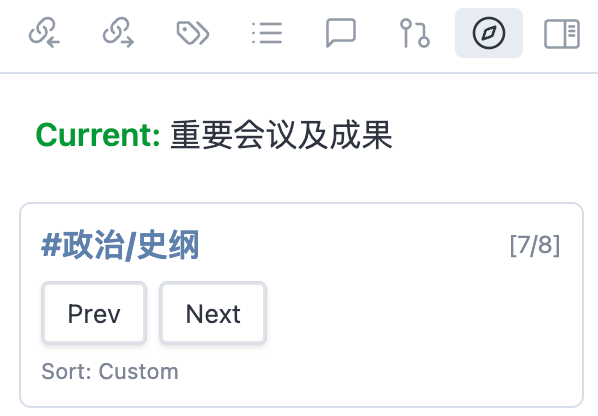
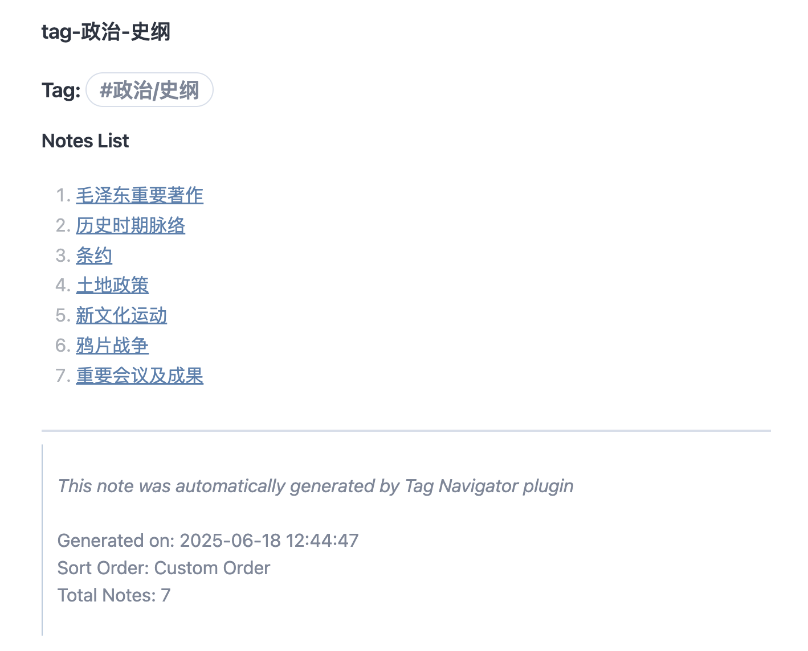

# Obsidian Tag Navigator

An intelligent navigation plugin for Obsidian that provides smart next/previous navigation based on tags and frontmatter properties.

## ✨ Features

### 🎯 Core Navigation
- **Tag-based navigation**: Create logical navigation sequences based on note tags
- **Multiple sorting options**: Sort by title, modification time, or custom order
- **Cross-folder navigation**: Navigate semantically across folder boundaries
- **Position tracking**: Shows current note position within tag sequences

### 🔧 User Interface
- **Side navigation panel**: Displays current note's tags with Prev/Next buttons
- **Manual navigation modal**: Visual sorting interface with drag-and-drop support
- **Tag management page**: Dedicated page for tag sorting and custom ordering
- **Settings integration**: Standard Obsidian settings panel integration

### 📁 Export & Management
- **JSON storage**: Custom sorting saved in plugin settings
- **Tag export**: Export tag navigation as numbered lists to Markdown files
- **Auto-folder creation**: Automatically creates export folders
- **Clean format**: Export files use blockquote-style footer with metadata

## 🚀 Quick Start

### Installation
1. Open Obsidian Settings → Community Plugins
2. Disable Safe Mode
3. Browse Community Plugins
4. Search for "Tag Navigator" and install

### Basic Usage
1. **Side panel**: Use command `Navigator: Toggle Next/Prev Panel`
2. **Manual sorting**: Use command `Navigator: Open manual navigation panel`
3. **Tag management**: Use command `Navigator: Open settings page`

## 📋 Commands

| Command | Description |
|---------|-------------|
| `Navigator: Toggle Next/Prev Panel` | Toggle side navigation panel |
| `Navigator: Open manual navigation panel` | Open manual sorting interface |
| `Navigator: Open settings page` | Open tag management page |
| `Navigator: Export all tags to notes` | Export all tags as note files |
| `Navigator: Go to next note` | Navigate to next note |
| `Navigator: Go to previous note` | Navigate to previous note |

## ⚙️ Settings

### Plugin Settings (Obsidian Settings Panel)
- **Default sort order**: Choose between title, modification time, or custom
- **Toast messages**: Enable/disable operation notifications
- **Export folder path**: Set folder for tag export files
- **Export filename format**: Customize export file naming (supports `{tag}` placeholder)

### Tag Management Page

<table>
  <tr>
    <td></td>
    <td></td>
    <td></td>
  </tr>
</table>

- **Left panel**: Tag list with three sorting modes:
  - By name (alphabetical)
  - By count (number of notes)
  - By custom status (customized tags first)
- **Right panel**: Drag-and-drop note sorting
- **Quick sort buttons**: Sort by modification time or title
- **Auto-save**: Drag sorting automatically saves

## 🏗️ Project Structure

```
obsidian-tag-navigator/
├── main.ts                          # Main plugin file
├── src/
│   ├── types/index.ts              # Type definitions
│   ├── utils/                      # Utility modules
│   │   ├── noteUtils.ts           # Note-related utilities
│   │   ├── sortUtils.ts           # Sorting logic
│   │   ├── exportUtils.ts         # Export functionality
│   │   └── navigationUtils.ts     # Navigation utilities
│   └── views/                      # View components
│       ├── NavigatorPanelView.ts   # Side panel view
│       ├── ManualNavigationModal.ts # Manual navigation modal
│       ├── SettingsPageView.ts     # Tag management page
│       └── SettingsTab.ts          # Obsidian settings tab
├── styles.css                      # Plugin styles
└── manifest.json                   # Plugin manifest
```

## 📝 Example Usage

### Side Navigation Panel
```
Current Note: Research Notes
Tags: #research, #methodology

#research [2/5] [Prev] [Next]
#methodology [1/3] [Prev] [Next]
```

### Tag Management
- Select a tag from the left panel
- Drag and drop notes in the right panel to reorder
- Use quick sort buttons for automatic sorting
- Changes are saved automatically

### Export Format
```markdown
# Tag: #research

## Notes List

1. [[Introduction to Research]]
2. [[Research Methodology]]
3. [[Data Collection]]

-----
> 
> *This note was automatically generated by Tag Navigator plugin*
> 
> Generated on: 2024-01-15 10:30:00
> Sort Order: Alphabetical (Title)
> Total Notes: 3
> 
```

## 🔧 Technical Details

- **TypeScript**: Full type safety and modern development
- **Modular architecture**: Clean separation of concerns
- **JSON storage**: Efficient custom sorting persistence
- **Responsive design**: Works on desktop and mobile
- **Obsidian API**: Full integration with Obsidian ecosystem

## 🤝 Contributing

Issues and Pull Requests are welcome!

## 📄 License

MIT License